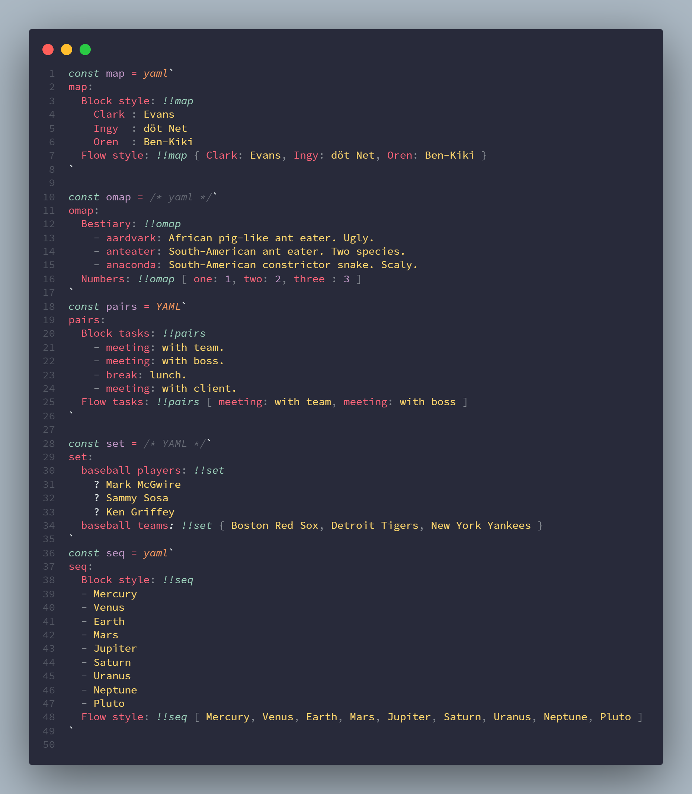

# Inline YAML Syntax Highlighting

Provides basic inline, template literal syntax highlighting through grammar injection for Javascript/Typescript files:

YAML examples taken from [js-yaml](https://github.com/nodeca/js-yaml) which are sourced from [yaml.org](https://yaml.org/type).
